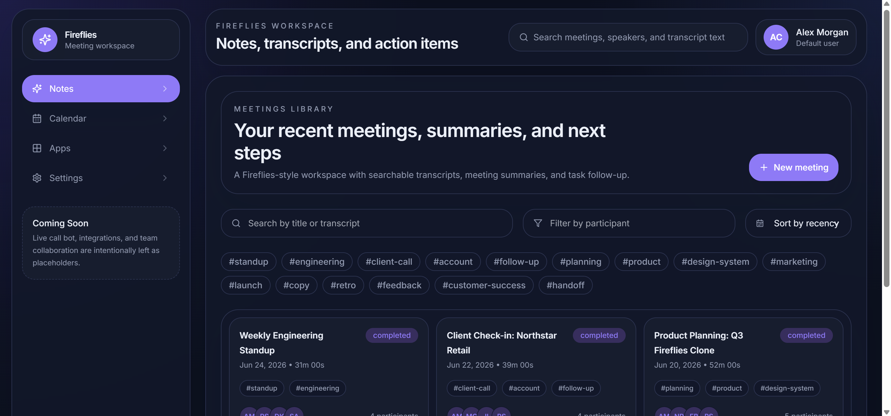
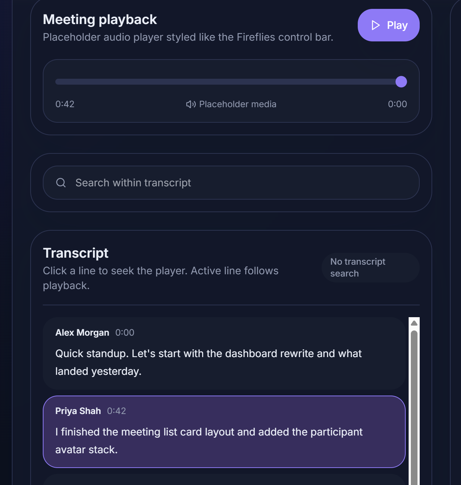

# 🎙️ Fireflies AI Clone

A full-stack clone of **Fireflies.ai** built using **Next.js**, **FastAPI**, **SQLAlchemy**, and **SQLite**. The application provides an interactive dashboard for viewing meetings, transcripts, AI summaries, participants, tags, and action items.

---

## 🚀 Live Demo

### Frontend
👉 https://fireflies-ai-clone-ten.vercel.app

### Backend API
👉 https://fireflies-ai-clone-dtxd.onrender.com

### Swagger API Documentation
👉 https://fireflies-ai-clone-dtxd.onrender.com/docs

---

# 📸 Screenshots

> Add your screenshots inside a folder named `screenshots`.

## Dashboard



## Meeting Details


## AI Summary


## Transcript



---

# ✨ Features

- 📋 Meeting Dashboard
- 🔍 Search meetings by title and transcript
- 🏷️ Tag filtering
- 👥 Participant information
- 📝 AI-generated meeting summaries
- 📄 Transcript viewer
- ✅ Action items
- 📤 Export functionality
- 🌙 Dark UI inspired by Fireflies.ai
- 📱 Responsive design
- 📚 Swagger API Documentation

---

# 🛠️ Tech Stack

## Frontend

- Next.js 14
- TypeScript
- Tailwind CSS

## Backend

- FastAPI
- SQLAlchemy
- Pydantic
- SQLite

## Deployment

- Vercel
- Render
- Docker

---

# 📂 Project Structure

```
fireflies-ai-clone/
│
├── backend/
│   ├── app/
│   │   ├── models/
│   │   ├── routers/
│   │   ├── schemas/
│   │   ├── services/
│   │   ├── database.py
│   │   ├── seed.py
│   │   └── main.py
│   │
│   ├── Dockerfile
│   └── requirements.txt
│
├── frontend/
│   ├── app/
│   ├── components/
│   ├── lib/
│   ├── styles/
│   ├── package.json
│   └── next.config.js
│
├── README.md
└── .gitignore
```

---

# ⚙️ Local Setup

## 1️⃣ Clone Repository

```bash
git clone https://github.com/sauravdas2004/fireflies-ai-clone.git

cd fireflies-ai-clone
```

---

## 2️⃣ Backend Setup

```bash
cd backend

python -m venv .venv
```

### Windows

```bash
.venv\Scripts\activate
```

### Linux / macOS

```bash
source .venv/bin/activate
```

Install dependencies

```bash
pip install -r requirements.txt
```

Run the backend

```bash
uvicorn app.main:app --reload
```

Backend will run on

```
http://localhost:8000
```

Swagger Documentation

```
http://localhost:8000/docs
```

---

## 3️⃣ Frontend Setup

```bash
cd frontend

npm install

npm run dev
```

Frontend

```
http://localhost:3000
```

---

# 🌍 Environment Variables

## Frontend (.env.local)

```env
NEXT_PUBLIC_API_BASE_URL=http://localhost:8000
```

For production

```env
NEXT_PUBLIC_API_BASE_URL=https://fireflies-ai-clone-dtxd.onrender.com
```

---

## Backend

```env
CORS_ORIGINS=http://localhost:3000
```

Production

```env
CORS_ORIGINS=http://localhost:3000,https://fireflies-ai-clone-ten.vercel.app
```

---

# 🚀 Deployment

## Frontend

Hosted on **Vercel**

Project Root

```
frontend/
```

---

## Backend

Hosted on **Render**

- Docker Deployment
- Automatic Database Seeding
- SQLite Database
- Swagger API Enabled

---

# 📡 API Endpoints

| Method | Endpoint | Description |
|---------|----------|-------------|
| GET | /meetings | Get all meetings |
| POST | /meetings | Create meeting |
| GET | /meetings/{id} | Get meeting details |
| PUT | /meetings/{id} | Update meeting |
| DELETE | /meetings/{id} | Delete meeting |
| GET | /transcripts | Get transcripts |
| GET | /summaries | Get AI summaries |
| GET | /action-items | Get action items |
| GET | /tags | Get tags |
| GET | /search | Search meetings |

Swagger Documentation

https://fireflies-ai-clone-dtxd.onrender.com/docs

---

# 📈 Project Status

| Module | Status |
|---------|--------|
| Database Models | ✅ |
| Seed Data | ✅ |
| REST API | ✅ |
| Meeting Dashboard | ✅ |
| Transcript Viewer | ✅ |
| AI Summary | ✅ |
| Action Items | ✅ |
| Search | ✅ |
| Docker Deployment | ✅ |
| Render Deployment | ✅ |
| Vercel Deployment | ✅ |

---

# 👨‍💻 Author

**Saurav Das**

GitHub

https://github.com/sauravdas2004

---

# ⭐ If you like this project, consider giving it a star!